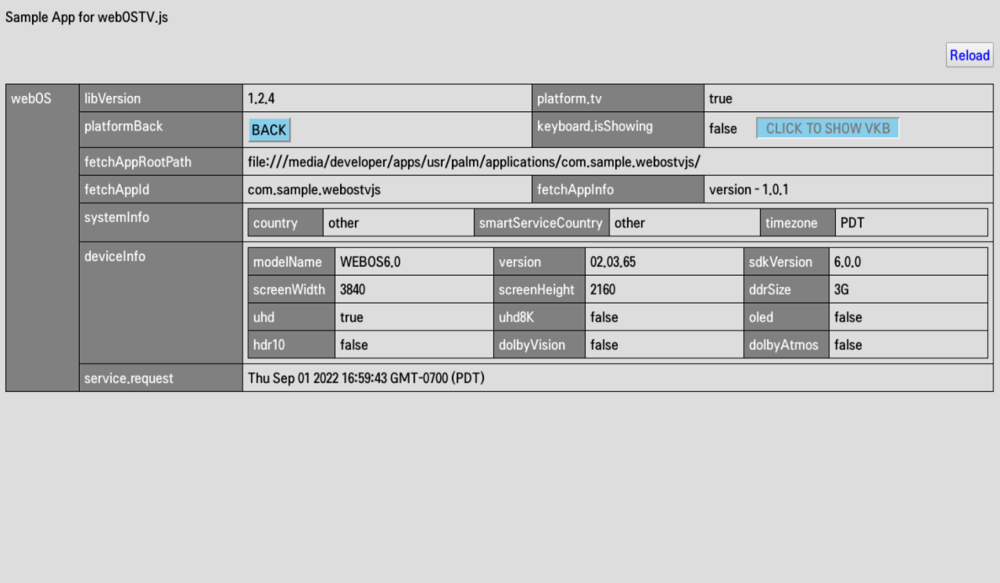
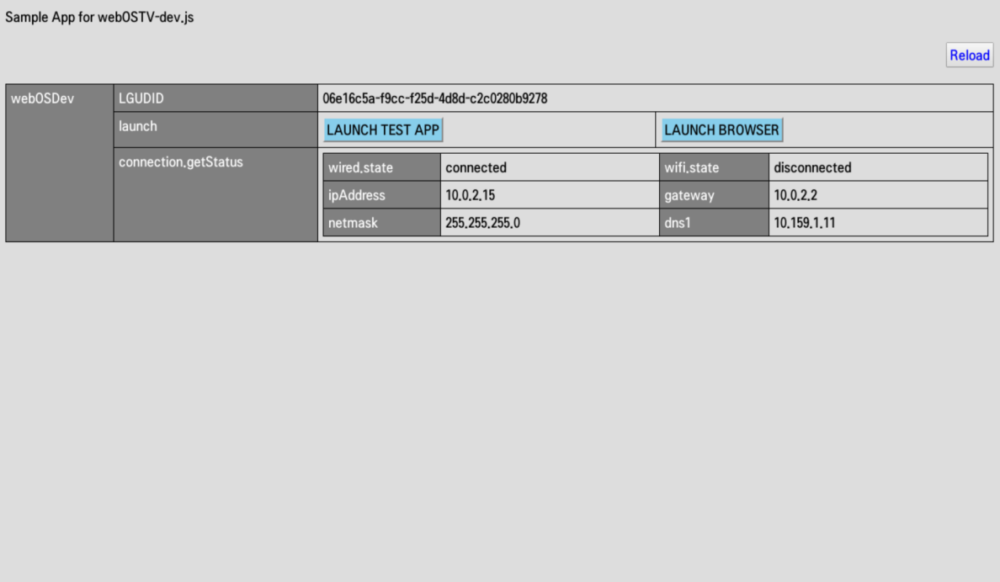
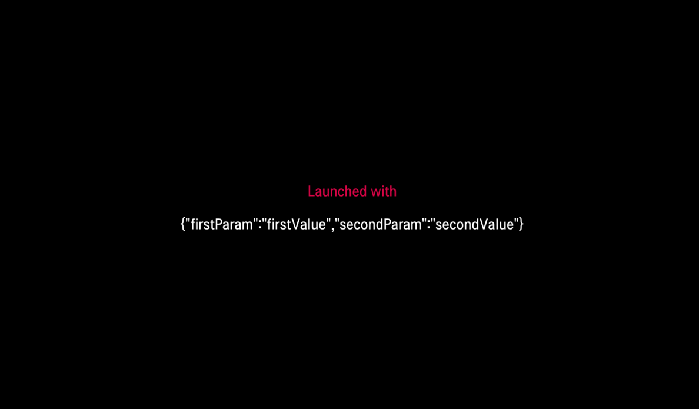

# webOSTV.JS Library

The webOSTV.js is a portable library to access to TV-specific features and functionality for webOS TV. The webOSTV.js
library provides a set of APIs for your app to use on webOS TV. For more information and the latest webOSTV.js download,
refer to [webOSTV.js](https://webostv.developer.lge.com/develop/references/webostvjs-introduction) in the API menu.

Here are sample codes for how to use the webOSTV.js library.

## Getting Device Information

To get device information, use
the [deviceinfo](https://webostv.developer.lge.com/develop/references/webostvjs-webos#deviceinfo) method of webOS API.

```javascript
webOS.deviceInfo(function (device) {
  getDeviceInfo(device);
});

function getDeviceInfo(device) {
  // do something with device info
}
```

## Launching an App with Parameters

To launch an app on the other app, use
the [launch](https://webostv.developer.lge.com/develop/references/webostvjs-webosdev#launch) method of webOSDev API.

```javascript
document.querySelector('#launchApp').addEventListener('click', function () {
  webOSDev.launch({
    id: 'com.sample.launchparams',
    params: {
      firstParam: 'firstValue',
      secondParam: 'secondValue',
    },
    onSuccess: function () {
      console.log('success');
    },
    onFailure: function (res) {
      console.log('failure', res.errorCode, res.errorText);
    },
  });
});
```

You can also execute an app using the ares-launch command of webOS TV CLI.

```bash
ares-launch com.sample.launch -p "{'key1':'value1','key2':'value2'}"
```

For more information about
the [ares-launch](https://webostv.developer.lge.com/develop/tools/cli-introduction#ares-launch)
command, refer to the CLI guide.

## Passing Launch Parameters

Here is a sample code for how to pass launch parameters.

```javascript
document.addEventListener('webOSLaunch', function (inData) {
  console.log("Launch: " + JSON.stringify(inData.detail));
  document.querySelector('#result').innerHTML = JSON.stringify(webOSDev.launchParams());
  document.querySelector('#type').innerHTML = 'Launched with';
}, true);

document.addEventListener('webOSRelaunch', function (inData) {
  console.log("Relaunch: " + JSON.stringify(inData.detail));
  document.querySelector('#result').innerHTML = JSON.stringify(webOSDev.launchParams());
  document.querySelector('#type').innerHTML = 'Relaunched with';
});
```

## Result in the webOS TV

You can install sample apps and see the results in the webOS TV or webOS TV emulator as below image.

- com.sample.webostvjs  
  

- com.sample.webostvjs.dev  
  

- com.sample.launchparams  
  

## Do's and Don'ts

- **Do** test these sample apps on your webOS TV or webOS TV Simulator.

- **Do** update the webOSTV.js library when the new version is released.

- **Do** install the 'com.sample.launchparams' sample app with the 'com.sample.webostv.dev' sample app. The LAUNCH TEST APP button in the 'com.sample.webostv.dev' sample app does not work if the 'com.sample.launchparams' sample app is not installed.
